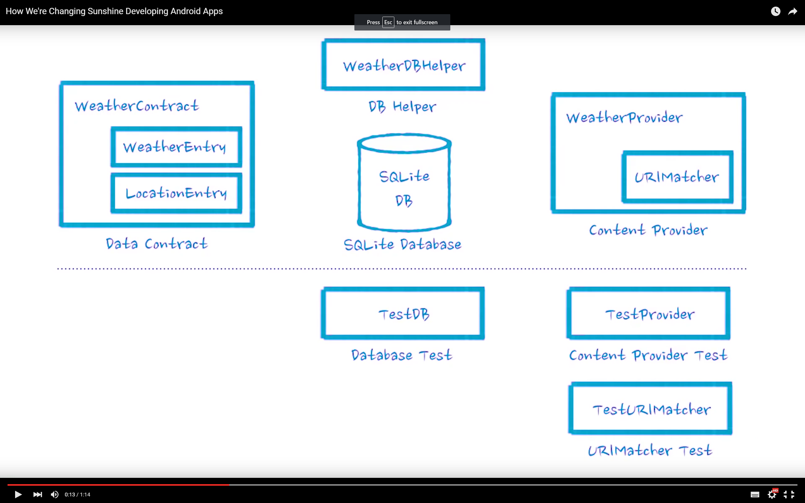
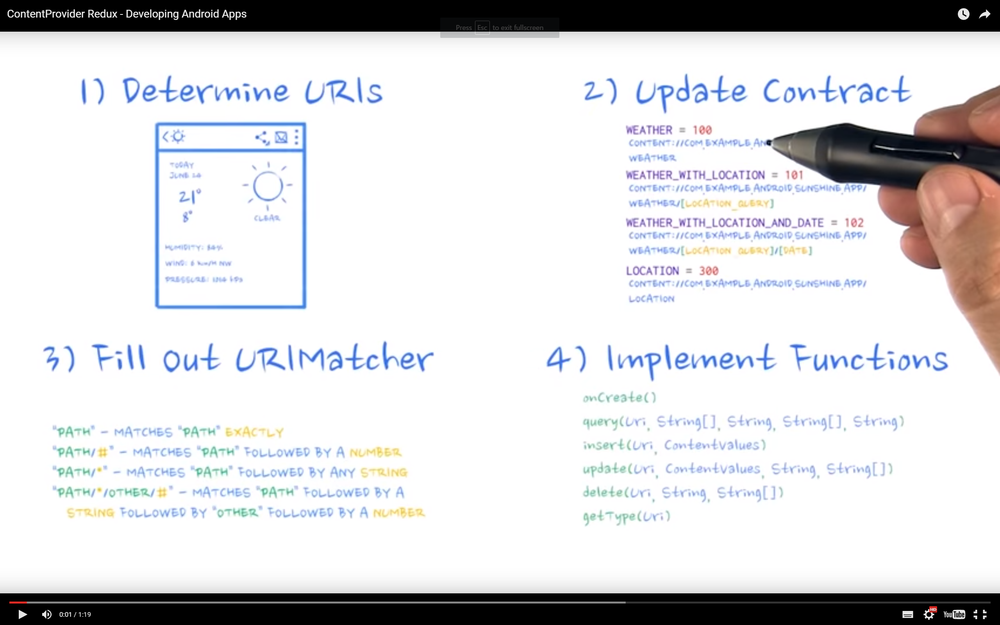

# [Developing Android Apps](https://www.udacity.com/course/progress#!/c-ud853)
@ [Udacity](https://www.udacity.com)
_via [Springboard](http://www.springboard.com)'s [Android App Development](https://www.springboard.com/learning-paths/android/ path
## Lesson 4

_because of its scope, lesson 4 was split into 3 lessons_

###4a
#### Lifecycle
* [Process and Application Lifecycle](http://developer.android.com/guide/topics/processes/process-lifecycle.html)
* [Managing the Activity Lifecycle](http://developer.android.com/training/basics/activity-lifecycle/index.html)
* the [Activities](http://developer.android.com/guide/components/activities.html) guide has a graphic demonstration of the lifecycle
#### baked-in SQLite data storage

* _[overview of changes](https://www.youtube.com/watch?v=Sif4ZAL8iU8)_
* _[optional SQLite tutorial](https://www.udacity.com/course/viewer#!/c-ud853/l-3621368730/m-2602608541)_
— you should (also) ensure that you understand SELECT w/ INNER JOIN, and the basic db crud queries
* [Storage Options](http://developer.android.com/guide/topics/data/data-storage.html)
* [Saving Data](http://developer.android.com/training/basics/data-storage/index.html)
* [Saving Data in SQL Databases](http://developer.android.com/training/basics/data-storage/databases.html)
— there is a section on Contracts, which isn't really a structure in android SDK. I think it is covered in the following:
* [BaseColumns](http://developer.android.com/reference/android/provider/BaseColumns.html)
* [SQLiteOpenHelper](http://developer.android.com/reference/android/database/sqlite/SQLiteOpenHelper.html)
* [SQLiteDatabase](http://developer.android.com/reference/android/database/sqlite/SQLiteDatabase.html)

#### a brief intro to testing
* — _some lovely references that might be more useful if you are reviewing your notes:_
* [Testing Concepts](http://developer.android.com/tools/testing/testing_android.html)
* _[Building Effective Unit Tests](http://developer.android.com/training/testing/unit-testing/index.html)_
* _[Best Practices for Testing](http://developer.android.com/training/testing/index.html)_
There are two different kinds available out of the box:
* [android.test](http://developer.android.com/reference/android/test/package-summary.html)
* [junit.framework.test](http://developer.android.com/reference/junit/framework/Test.html)

###4b

####Content Providers
* [Content Provider basics](http://developer.android.com/guide/topics/providers/content-provider-basics.html)
* [Creating a Content Provider](http://developer.android.com/guide/topics/providers/content-provider-creating.html)
* [ContentProvider](http://developer.android.com/reference/android/content/ContentProvider.html)

####Testing It
* [Testing Your Content Provider](http://developer.android.com/training/testing/integration-testing/content-provider-testing.html)

####Content URIs
* [Content Uris](http://developer.android.com/reference/android/content/ContentUris.html)
* [Uri.Builder](http://developer.android.com/reference/android/net/Uri.Builder.html) and 
* [UriMatcher](http://developer.android.com/reference/android/content/UriMatcher.html)
* [parseId](http://developer.android.com/reference/android/content/ContentUris.html#parseId%28android.net.Uri%29) implements a common convention for API communications

####Using it
* [accessing your content from the Content Provider](http://developer.android.com/guide/topics/providers/content-provider-basics.html#ClientProvider)
* Provider in [Manifest](http://developer.android.com/guide/topics/manifest/provider-element.html)

[In review video](https://www.udacity.com/course/viewer#!/c-ud853/l-3599339441/m-3655209144)

###4c
####Loaders
* [Loaders](http://developer.android.com/guide/components/loaders.html)
* [AsyncTaskLoader](http://developer.android.com/reference/android/content/AsyncTaskLoader.html)
* [Loader](http://developer.android.com/reference/android/content/Loader.html)
* [LoaderManager.LoaderCallbacks](http://developer.android.com/reference/android/app/LoaderManager.LoaderCallbacks.html)

**[Overview of how these classes are used in the app to get data and store through the content uri ](https://www.udacity.com/course/viewer#!/c-ud853/l-3681658545/m-3666728992)**
also [Misc notes for 4c](https://www.udacity.com/course/viewer#!/c-ud853/l-3681658545/m-3649658972) - contains an overview diagram

####Content.CursorLoaders
* [CursorLoader](http://developer.android.com/reference/android/content/CursorLoader.html)

_see the example on creating and referencing Projections for the query [here](https://www.udacity.com/course/viewer#!/c-ud853/l-3681658545/e-3650909019/m-3606839932)._ Personally in this app I favor creating and Interface and implementing it as needed.

####ShareActionProvider
_remember [Adding An Easy Share Action](http://developer.android.com/training/sharing/shareaction.html)?_
* [ShareActionProvider](http://developer.android.com/reference/android/widget/ShareActionProvider.html)

_[making the Content Provider accessible](http://developer.android.com/guide/topics/providers/content-provider-creating.html#ProviderElement) and [Permissions](http://developer.android.com/guide/topics/providers/content-provider-creating.html#Permissions)_

### Notes from a second source on content providers

After setting up alarge, highly separated content provider like we did, you might still have questions about what it is, and what it really takes to implement one (without building out everything one can into an enterprise-like solution). Here's a separate source:

#### [Content Providers](http://mgolokhov.github.io/content_providers/)
Keep on reading, if you answered “yes” to any of these questions:

* Do you have a structured set of data and want to share it across applications (processes)?
* Would you like to have access to contacts and the call log?
* Do you want to integrate your own search suggestions with the Android Quick Search Box?
* Would you like to implement App Widgets?
* Do you want a fancy syncing and querying data with auto-UI update?

Are you still with me? The following text describes content providers in more detail.

This topic is all about managing data (mostly stuctured, like DB). There are two sides ContentResolver (a client, data consumer) and ContentProvider. The provider object receives data requests from clients, performs the requested action, and returns the results. Android itself manages data such as audio, video, images, personal contact information with the help of content providers a lot.

To work with data you’ll expect basic CRUD (create, retrieve, update, delete) operations. And here you are: insert(), update(), delete(), and query() methods. Again, it smells like DB, but don’t be fooled, content provider is just a layer (proxy) for data that lives somewhere else (SQlite database, on the file system, in flat files or on a remote server).

Pretty simple and staightforward so far. But how do cliens find provider? Well, it’s required to know the URIs of a provider to access it. The recomendation is to publish public constants for the URIs and document them to other developers. The URI has following format:

`scheme://authority/optional_data_type/optional_id`

Yeah, Google likes a Uniform Resource Identifiers that identify abstract or physical resources, as specified by [RFC 2396](http://www.ietf.org/rfc/rfc2396.txt). It’s the most important concept to understand when dealing with content providers. Here is the detail of various parts:

* scheme - always set to `content://`
* authority - a unique string used to locate your content provider and it should almost be a package name of your application, e.g. doit.study.droid.quizprovider
* optional_data_type - the optional path, is used to distinguish the kinds of data your content provider offers. For example, if you are getting all the topics from the Quiz content provider, then the data path would be topic and URI would look like this content://doit.study.droid.quizprovider/topic, for questions - doit.study.droid.quizprovider/question
* optional_id - specifies the specific record requested. For example, if you are looking for topic number 5 in the Quiz content provider then URI would look like this content://doit.study.droid.quizprovider/topic/5

There are two types of URIs: directory- and id-based URIs:

Type	Usage	Constant
vnd.android.cursor.item	Used for single records	ContentResolver.CURSOR_ITEM_BASE_TYPE
vnd.android.cursor.dir	Used for multiple records	ContentResolver.CURSOR_DIR_BASE_TYPE

When a request is made via a ContentResolver the Andoid OS inspects the authority of the given URI and passes the request to the content provider registered with that authority (finds a match in the AndroidManifest.xml). The content provider can interpret the rest of the URI however it wants. Actually, it can look like traditional URIs with keys and values: `optional_data_type/sub_type?key=value`

To make your life easier there is the [UriMatcher](http://developer.android.com/reference/android/content/UriMatcher.html) class that parses URIs. You will tied each URI type to the constant integer with method

`addURI(String authority, String path, int code)`
Are you thrilled to write your own Content Provider? It’s very easy if you have already put data in DB. Do simple steps:

1. extend ContentProvider base class
2. define your URI address
3. implement CRUD operations (override query methods)
4. register your Content Provider in your AndroidManifest.xml file using tag.
5. Here is the list of query methods you should override:

* onCreate()	is called when the provider is started.
* query()	receives a request from a client and the result is returned as a Cursor object.
* insert()	inserts a new record into the content provider.
* delete()	deletes an existing record from the content provider.
* update()	updates an existing record from the content provider.
* getType()	returns the MIME type of the data at the given URI. The returned type should start with vnd.android.cursor.item for a single record, or vnd.android.cursor.dir/ for multiple items

#### [Cursor Loaders](http://mgolokhov.github.io/cursor_loader/)

Content Provider has a very good friend, his name is CursorLoader, who does all hard work (runs a query) asynchronously in the background and reconnects to your Activity or Fragment when it’s finished. With the help of CursorLoader a happy user doesn’t see delay in the UI, or worse, “Application Not Responding” (ANR). Besides doing the initial background query, a CursorLoader automatically re-runs the query when data associated with the query changes.

CursorLoader class implements the [Loader](http://developer.android.com/reference/android/content/Loader.html) protocol in a standard way for querying cursors, building on [AsyncTaskLoader](http://developer.android.com/reference/android/content/AsyncTaskLoader.html) to perform the cursor query on a background thread. Implementing CursorLoader you’ll bump into

* [LoaderManager](http://developer.android.com/reference/android/app/LoaderManager.html) - manages your Loaders for you. Responsible for dealing with the Activity or Fragment lifecycle.
* [LoaderManager.LoaderCallbacks](http://developer.android.com/reference/android/app/LoaderManager.LoaderCallbacks.html) - a callback interface for a client to interact with the LoaderManager.

Let’s study how to use these classes and interfaces in an application.

##### LoaderManager
LoaderManager is associated with an Activity or Fragment (host) for managing one or more Loader instances added to the manager. There is only one LoaderManager per host, but a LoaderManager can have multiple loaders. This class keeps your Loaders in line with the lifecycle of your host. If Android destroys your fragment or activity, the LoaderManager notifies the managed loaders to free up their resources. The LoaderManager is also responsible for retaining your data on configuration changes (e.g. orientation) and it calls the relevant callback methods when the data changes. You do not instantiate the LoaderManager yourself. Instead you simply call getLoaderManager() from within your host.

Most often you are only interested in two methods of the manager:

* initLoader
* restartLoader